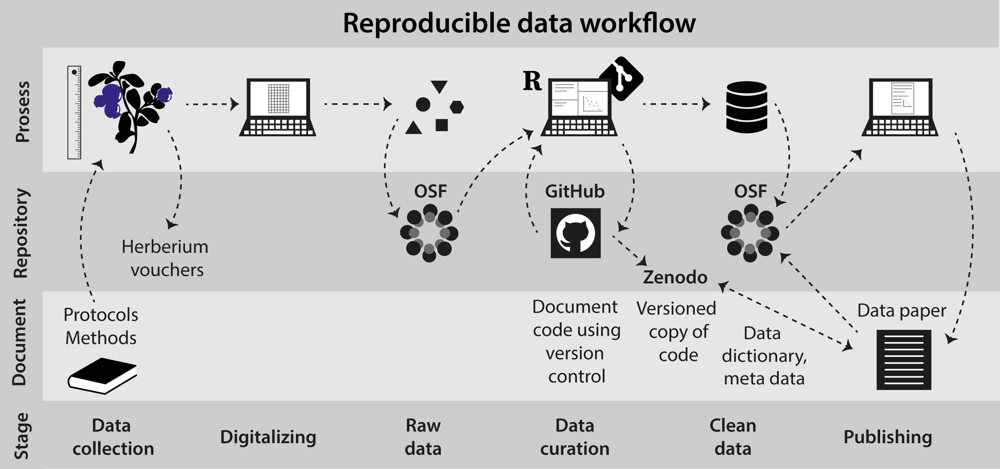
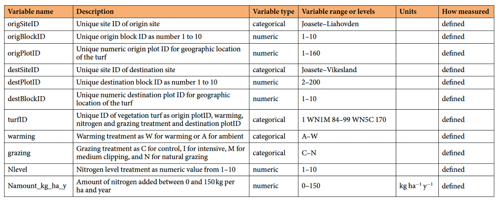

# NatuRA data management

This is the git repository for the [NatuRA project](https://osf.io/328hc/overview).
The goal of this repo is to organize and streamline data management in the project and beyond.

 

## The general workflow

Good data management is an integral part of the NatuRA project, not an afterthought.
It should start early — ideally before the first data are collected — and be maintained throughout the project lifetime.

The general workflow is:

1. **Collect data** following the field protocols that describe how data are collected.
  Protocols must be documented and stored with the project.
   Any deviation from a standard protocol must be noted in the field and described in the cleaning code.
2. **Store raw data on OSF.**
  Raw data are never modified by hand.
   Once uploaded, a raw file is considered read-only.
3. **Clean and process data using code.**
  All cleaning, transformation and quality checks are done in R scripts (or other programming language) stored on GitHub.
   No manual editing of data files (e.g. in Excel).
   Version control via Git/GitHub ensures that every change is tracked and reproducible.
   All decisions made during cleaning — such as removing outliers, correcting errors, or transforming variables — must be documented directly in the cleaning code with comments explaining the reasoning.
4. **Store clean data on OSF.**
  Clean datasets are uploaded to OSF alongside the raw data.
   Each dataset must have a corresponding data dictionary (see below).
5. **Document everything.**
  Documentation is important.
   Field protocols describe data collection.
   Any deviation from these protocols needs to be noted.
   Cleaning code documents data decisions.
   Data dictionaries describe each dataset.
   All of this documentation will be compiled into a **data paper** at the end of the project.



*Reproducible data workflow (adapted from the FunCaB project).*

## Where is what?

### Data

Raw and clean **datasets** are stored on [OSF](https://osf.io/328hc/overview).
The OSF repository is currently **private** — only people with access can see the data.
It can be made fully open at the end of the project.
To request access, create an account on [osf.io](https://osf.io) and share your username with the project team.

An overview of all datasets is available in this [Google Sheet](https://docs.google.com/spreadsheets/d/1OE0FerDTSs1QAzUIeolbhrT6jGonxVd5/edit?usp=sharing&ouid=107981331666023309816&rtpof=true&sd=true).
Add any new dataset that is collected here, so we have a good overview of all the datasets that exits.

### Code

All R code for cleaning, managing and analysing data lives in this GitHub repository.  
We use [Git/GitHub](https://biostats-r.github.io/biostats/github/) for version control. Code pushed to GitHub should be clean, tested, and run on any computer.  
Here is a useful resource for how to set up and use [Git/GitHub.](https://biostats-r.github.io/biostats/github/)

### Documentation

Data documentation — field protocols, cleaning decisions, and data dictionaries — is maintained alongside the code in this repository and on OSF.

A draft of the **data paper** is available [here](https://docs.google.com/document/d/1oUQ7zQ1oi45cnvNGPOpQYrq0fkq30wZx/edit?usp=sharing&ouid=107981331666023309816&rtpof=true&sd=true) (access restricted to authors).

### Data dictionary

Each dataset must have a **data dictionary** that describes every variable: its name, a plain-language description, units or treatment levels, and how it was measured.

The R package **dataDocumentation** helps produce standardised data dictionaries.
Install and load it as follows:

```r
# if needed install the remotes package
install.packages("remotes")

# then install the dataDocumentation package
remotes::install_github("audhalbritter/dataDocumentation")

# and load it
library(dataDocumentation)
```

For full instructions see the [dataDocumentation readme](https://github.com/audhalbritter/dataDocumentation).



*Example data dictionary.*

## Standards and naming conventions

### File names

File names follow this pattern:

```
NatuRA_<status>_<response>_<year>.<extension>
```


| Component     | Description                      | Example                      |
| ------------- | -------------------------------- | ---------------------------- |
| `NatuRA`      | Project prefix, always the same  | `NatuRA`                     |
| `<status>`    | Whether the file is raw or clean | `raw`, `clean`               |
| `<response>`  | What the file contains           | `cflux`, `biomass`, `traits` |
| `<year>`      | Year(s) of data collection       | `2026`, `2025-2026`          |
| `<extension>` | File extension                   | `csv`, `txt`                 |


Examples:

```
NatuRA_raw_cflux_2026.csv
NatuRA_clean_cflux_2026.csv
```


### Variable names

Use **meaningful names** that describe what the variable contains.
Avoid abbreviations that are not immediately obvious (e.g. prefer `soil_temperature_c` over `st`).

We use **snake_case** throughout: lower-case letters separated by underscores.
Examples: `soil_moisture`, `carbon_flux`, `site_id`.

### Code style

All R code uses **snake_case** for variable and function names.
Scripts should be self-contained and well-commented where non-obvious decisions are made.

### Data format

Datasets should be in **long format**.
Long format data is more compact and easier to read.
If you have several response variables (e.g. multiple traits or flux measurements), use `pivot_longer()` to reshape the data:

```r
data |>
  pivot_longer(cols = ..., names_to = "variable", values_to = "value")
```

Using `variable` and `value` as column names is a project standard.
If variables have different units, add a `unit` column.

When structuring a dataset, prefer this column order:

- `date` and/or `year`
- site and location identifiers
- treatment identifiers
- plot and sample identifiers
- species or focal organism
- response variable, value, unit
- predictor and covariate variables
- other variables (e.g. `remark`, `data_collector`, `weather`, `flag`)


## Useful resources

[Biostats](https://biostats-r.github.io/biostats/) with tutorials on R, making figures, Git/GitHub.